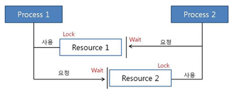

# 데드락(DeadLock)
> 프로세스가 자원을 얻지 못해 다음 처리를 하지 못하는 상태      
> **교착 상태**라고도 부름      
> 시스템적으로 한정된 자원을 여러 곳에서 사용하려고 할 때 발생

### 데드락이 발생하는 경우
       
프로세스1과 2가 자원 1, 2를 모두 요청했다고 가정해보자
<pre><code>task1: 프로세스1이 자원1을 얻음, 프로세스2가 자원2를 얻음        
task2: 프로세스1은 자원2를 기다림, 프로세스2는 자원1을 기다림
‼️ 현재 서로 원하는 자원이 상대방에 할당되어 있어 두 프로세스는 무한정 wait 상태에 빠짐</code></pre>       

**주로 발생하는 경우** 
1. 멀티 프로그래밍 환경에서 한정된 자원을 얻기 위해 서로 경쟁하는 상황 발생
2. 한 프로세스가 자원을 요청했을 때, 동시에 그 자원을 사용할 수 없는 상황이 발생할 수 있음.     
이 때 이 프로세스는 대기 상태로 들어감
3. 대기 상태로 들어간 프로세스들이 실행 상태로 변경될 수 없을 때 **교착 상태** 발생

### 데드락 발생 조건
아래 4가지 조건을 **모두 성립**해야 데드락 발생
1. 상호 배제(Mutual Exclusion): 자원은 한 번에 하나의 프로세스만 사용할 수 있음
2. 점유 대기(Hold and Wait): 하나의 자원을 점유하고 있으면서 다른 프로세스가 사용하고 있는      
자원을 추가로 점유하기 위해 대기하는 프로세스가 존재해야 함
3. 비선점(No Preemption): 다른 프로세스에 할당된 자원은 사용이 끝날 때까지 강제로 뺏을 수 없음
4. 순환 대기(Circular Wait): 두 개 이상의 프로세스가 서로 상대방이 가진 자원을 점유하기 위해 대기해야함

### 데드락 처리
1. 교착 상태 **예방**(prevention): 교착 상태 발생 조건 중 하나를 제거해 사전에 예방
    - 상호배제 방지: 여러 프로세스가 공유 자원 사용
    - 점유대기 방지: 프로세스 실행에 필요한 모든 자원을 한꺼번에 요구하고 허용할 때까지 작업을 보류
    - 비선점 방지: 프로세스가 자원을 점유중일 때 우선순위가 높은 프로세스가 자원을 요구한다면 해당 자원 반납
    - 순환대기 방지: 모든 자원에 고유번호를 할당한 후 모든 프로세스가 번호순대로 자원을 요구하도록 함,      
    필요한 자원을 번호가 작은 것 부터 큰 순서대로 획득하도록 한다면 추가로 필요한 자원들이 어떠한 프로세스에게도 점유 되어 있지 않음을 보장     
    <pre><code>사실 어떠한 프로세스에게도 점유 되어 있지 않다는 말은 이해할 수 없지만 어쨌든        
    다른 프로세스와 내가 서로의 자원을 점유하려는 상황이 절대 발생할 수 없기 때문에 순환대기 방지할 수 있는 것</code></pre>
2. 교착 상태 **회피**(avoidance): 교착 상태 발생 여부를 사전에 조사해 피하는 방법
    - 은행원 알고리즘
        1. 은행에서 모든 고객의 요구가 충족되도록 현금을 할당하는데서 유래
        2. 미리 결정된 모든 자원들의 최대 할당량과 현재 할당량을 가지고 결정된 프로세스의 순서대로       
        원하는 자원들을 할당해줬을 때 Safe state에 들 수 있는지 여부(교착 상태 발생 여부)를 검사
        3. Safe state에 들면 자원 할당, 아니면 다른 프로세스들이 자원 해지할 때까지 대기
3. 교착 상태 **탐지** 및 **회복**: 교착 상태가 되도록 허용한 다음 회복시키는 방법
    - 탐지(detection)
        1. 자원 할당 그래프를 통해 교착 상태 탐지
        2. 자원 요청 시, 탐지 알고리즘을 실행시켜 그에 대한 오버헤드 발생
    - 회복(recovery)
        1. 교착 상태 일으킨 프로세스를 종료하거나, 할당된 자원을 해제시켜 회복시키는 방법
        2. 프로세스 종료 방법
            - 교착 상태의 프로세스를 모두 중지
            - 교착 상태가 제거될 때까지 프로세스 하나씩 중지
        3. 자원 선점 방법
            - 교착 상태의 프로세스가 점유하고 있는 자원을 선점해 다른 프로세스에게 할당(해당 프로세스 일시정지 시킴)
            - 우선 순위가 낮은 프로세스나 수행 횟수 적은 프로세스 위주로 자원 선점

### 주요 질문
1. 데드락(교착 상태)가 뭔가요? 발생 조건에 대해 말해보세요.     
    두 개 이상의 프로세스가 필요한 자원을 서로 점유하고 있어 계속 대기하는 상태     
    상호배제, 점유대기, 비선점, 순환대기

2. 회피 기법인 은행원 알고리즘이 뭔지 설명해보세요.

3. 기아상태를 설명하는 식사하는 철학자 문제에 대해 설명해보세요.
    **교착 상태 해결책**
    1. n명이 앉을 수 있는 테이블에서 철학자를 n-1명만 앉힘
    2. 한 철학자가 젓가락 두개를 모두 집을 수 있는 상황에서만 젓가락 집도록 허용
    3. 누군가는 왼쪽 젓가락을 먼저 집지 않고 오른쪽 젓가락을 먼저 집도록 허용