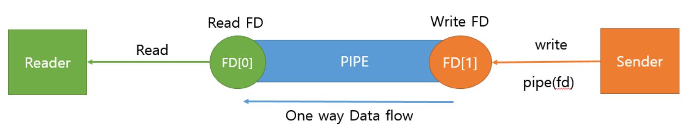
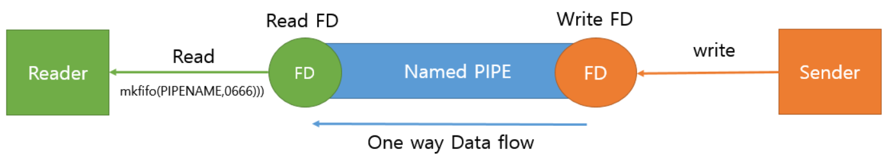
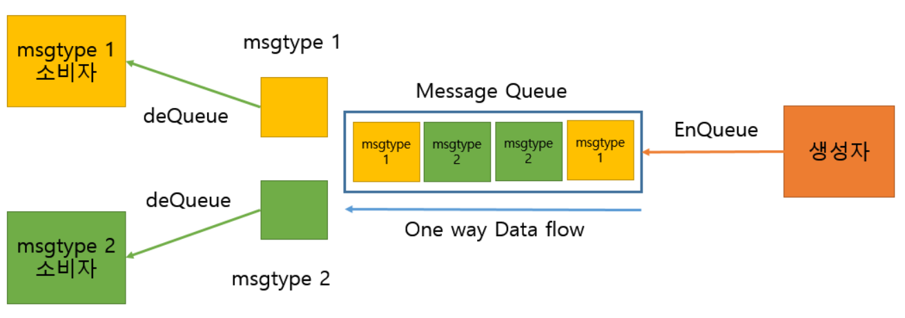
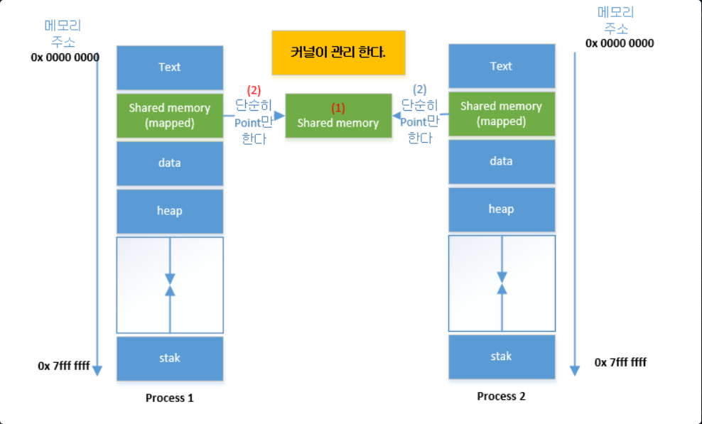
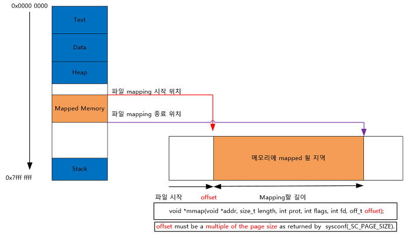

# IPC(Inter Process Communication)
IPC 통신: **독립적 구조**를 가진 **프로세스 간의 통신**을 가능하게 해주는 것        
프로세스는 `커널이 제공`하는 IPC 설비를 이용해 프로세스 간 통신을 할 수 있게 됨     
<code>💡 커널: 운영체제의 핵심적인 부분으로, 다른 모든 부분에 여러 기본적인 서비스를 제공</code>

### IPC 설비 종류
1. 익명 PIPE        
    - 두개의 프로세스를 연결, 한 프로세스는 데이터를 쓰기만 하고, 다른 하나는 읽기만 함
    - **한쪽 방향으로만 통신이 가능한 반이중 통신**
    - 양쪽 송/수신(전이중 통신) 가능하게 하려면 2개의 파이프 사용
    - `통신할 프로세스를 명확히 알 수 있을 때` 사용 (부모-자식 간 프로세스 통신)
    - 매우 간단, 단순한 데이터 흐름일 때는 효율적으로 사용
    - 전이중 통신 위해 2개 만들 때는 구현 복잡해짐
      
2. Named PIPE(FIFO)
    - `전혀 관련없는 다른 프로세스끼리 통신`할 때 사용
    - 동시 읽기/쓰기 불가능
    - 전이중 통신 위해선 익명 파이프처럼 두개 만들어야 됨
      
3. Message Queue
    - 입출력 방식은 Named PIPE와 동일
    - 파이프처럼 데이터의 흐름이 아닌 메모리 공간임
    - 사용할 데이터에 번호를 붙여 여러 프로세스가 동시에 데이터를 쉽게 다룰 수 있음
      
4. 공유 메모리
    - 파이프, 메시지 큐는 통신 방식. 공유 메모리는 데이터 자체를 공유하도록 지원하는 설비
    - 프로세스 간 메모리 영역을 공유해서 다른 프로세스의 데이터를 사용할 수 있도록 허용해줌
    - 프로세스가 공유 메모리 할당을 커널에 요청하면, 커널은 해당 프로세스에 메모리 공간을       
    할당해주고 이후 모든 프로세스는 해당 메모리 영역에 접근할 수 있게 됨
    - 곧바로 메모리에 접근할 수 있기에 IPC 중에서 가장 빠름
      
5. 메모리 맵
    - 공유 메모리처럼 메모리 공유
    - 열린 파일을 메모리에 맵핑시켜서 공유하는 방식 (공유 매개체가 파일+메모리)
    - 파일로 대용량 데이터를 공유해야 할 때 사용        
    
6. 소켓
    - 네트워크 소켓 통신을 통해 데이터 공유
    - 클라이언트와 서버가 소켓을 통해 통신하는 구조
    - 원격에서 프로세스 간 데이터를 공유할 때 사용      
    

> IPC 통신에서 프로세스 간 데이터를 동기화하고 보호하기 위해선 세마포어와 뮤텍스를 사용     
>(공유된 자원에 한번에 하나의 프로세스만 접근시킬 때)
