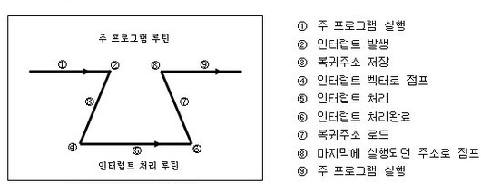

# 인터럽트(Interrupt)

### 정의    
프로그램 실행하는 도중에 예기치 않은 상황이 발생할 경우         
현재 실행 중인 작업을 중단하고, CPU에게 해당 상황을 처리해달라고 알리는 것      
=> 지금 수행 중인 일보다 더 중요한 일(`입출력, 우선 순위 연산 등`)이 발생하면       
그 일을 먼저 처리하고 나서 하던 일을 계속함     

> 외부/내부 인터럽트는 `CPU의 하드웨어 신호에 의해 발생`        
> 소프트웨어 인터럽트는 `명령어의 수행에 의해 발생`     

### 외부 인터럽트 
입출력 장치, 타이밍 장치, 전원 등 **외부적인 요인**으로 발생        
`전원 이상, 기계 착오, 외부 신호, 입출력`

### 내부 인터럽트
**Trap**이라고 부르며, **잘못된 명령이나 데이터를 사용**할 때 발생      
`0으로 나누기 발생, 오버플로우, 명렁어 잘못 사용 (Exception)`

### 소프트웨어 인터럽트
프로그램 처리 중 명령의 요청에 의해 발생한 것 (SVC 인터럽트)
> **사용자가 프로그램을 실행**시킬 때 발생      
> 소프트웨어 사용 중에 다른 프로세스 실행시키면 시분할 처리를 위해      
> 자원 할당 동작이 수행됨

### 인터럽트 발생 처리 과정
     
        
주 프로그램이 실행되다 **인터럽트 발생**
1. 현재 수행 중인 프로그램 중지
2. 상태 레지스터와 PC 등을 `스택에 임시 저장`한 뒤 인터럽트 서비스 루틴 수행      
(인터럽트 서비스 루틴이 끝난 뒤에 원래 작업을 수행해야 하기에 `임시 저장`)      

만일 **인터럽트 기능이 없었다면** 컨트롤러는 특정 작업이 수행되어야 할 시기를 계속 체크해줘야 함     
=> 폴링(Polling)이라 함     
**폴링**을 하는 시간에는 원래 하던 일에 집중할 수 없게 되어 많은 기능을 제대로 수행하지 못하게 됨       

### 컨트롤러가 입력을 받아들이는 방법 (우선순위 판별방법)
1. 폴링 방식        
사용자가 명령어를 사용해 입력 핀의 값을 계속 읽어 변화를 알아내는 방식      
인터럽트 요청 플래그를 차례로 비교해 우선수위가 가장 높은 인터럽트 자원을 찾아      
이에 맞는 인터럽트 서비스 루틴을 수행 (하드웨어에 비해 속도가 느림)
2. 인터럽트 방식
MCU(microcontroller unit) 자체가 하드웨어적으로 변화를 체크해 변화 시에만 일정한 동작을 하는 방식
- Daisy Chain
- 병렬 우선순위 부여

<code>MCU: 마이크로프로세서와 입출력 모듈을 하나의 칩으로 만들어 정해진 기능을 수행하는 컴퓨터      
Daisy Chain: 연속적으로 연결되어 있는 하드웨어 장치들의 구성
</code>

> 인터럽트 방식은 하드웨어 지원을 받아야 하지만 폴링에 비해 신속 대응이 가능        
> **실시간 대응**이 필요할 때 필수적인 기능     
> 인터럽트는 **발생시기를 예측하기 힘든 경우에 컨트롤러가 가장 빠르게 대응할 수 있는 방법**