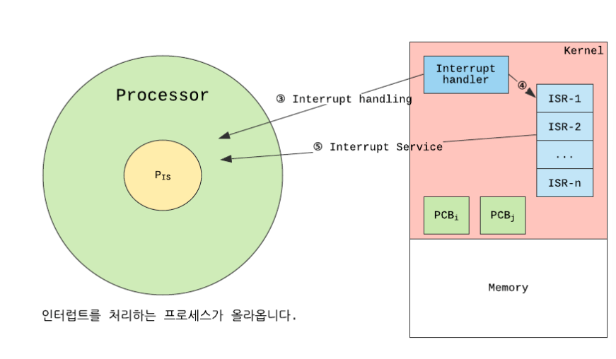

# PCB & Context Switching
### Process Management
> 프로세스가 여러개일 때, CPU가 프로세스들을 CPU 스케줄링을 통해 관리하는 것을 말함     
CPU는 `Process Metadata`를 통해 각 프로세스를 구분

**Process Metadata에 담긴 정보**
1. Process ID
2. Process State: 생성, 준비, 실행, 대기, 완료 상태
3. Process Counter: 프로세스가 다음에 실행할 명령어의 주소 (주소 레지스터)
4. CPU Registers
5. Process Priority
6. Owner
7. CPU Usage
8. Memory Usage     

=> 해당 메타데이터는 프로세스가 생성되면 `PCB(Process Control Block)`에 저장됨

### PCB(Process Control Block)
프로세스 메타데이터들을 저장해 놓는 곳, 한 PCB 안에는 한 프로세스의 정보가 담김

<pre><code>프로세스 실행 → 프로세스 생성 → 프로세스 주소 공간에 (코드, 데이터, 스택) 생성        
→ 이 프로세스의 메타데이터들이 PCB에 저장 </code></pre>
1. 커널 공간 내에 존재
2. OS가 각 프로세스 관리에 필요한 정보를 저장
3. **프로세스가 생성될 때 함께 커널에 생성**

    

**PCB가 필요한 이유**   
CPU에서는 프로세스의 상태에 따라 교체작업이 이루어짐.       
(Interrupt가 발생해서 할당받은 프로세스가 waiting 상태가 되고 다른 프로세스를       
running으로 바꿔줄 때)      
❗️이때, 다시 수행할 waiting 프로세스에 대한 정보를 PCB에 저장해둠

**PCB 관리 방식**   
`Linked List 방식`으로 관리됨       
PCB List Head에 PCB들이 생성될 때마다 붙게 됨. 연결리스트 구조이기에 삽입, 삭제 용이        
=> `프로세스 생성되면 해당 PCB가 생성되고 프로세스 완료 시 제거  `    

### Context Switching
CPU가 어떤 프로세스를 실행하고 있는 상태에서 스케줄러가 인터럽트를 진행해       
더 높은 우선순위를 가진 프로세스가 실행되어야 할 때, 스케줄러가 레지스터에 저장된       
기존 프로세스 정보 값이나 프로세스 상태 값을 커널 내에 존재하는 PCB에 저장하고,       
새 프로세스의 정보 값이나 상태 값을 PCB에서 다시 가져와 레지스터에 적재하는 작업

<pre><code>
즉, 프로세스는 CPU가 처리하던 작업의 내용들을 자신의 PCB에 저장하고,        
다음에 다시 CPU를 점유하여 작업을 수행해야 할 때 PCB로부터 해당 정보들을        
CPU에 넘겨서 작업을 마저 진행할 수 있음
</code></pre>

**컨텍스트 스위칭을 가능하게 만드는 정보**
1. 프로그램 카운터(PC)
- 마이크로프로세서 내부에 있는 레지스터 중의 하나       
- `다음에 실행될 명령어의 주소`를 가지고 있어 실행할 기계어 코드의 위치를 지정
- 간단히 코드 한줄한줄을 가리키는 주소 레지스터
2. 스택 포인터(SP)
- CPU 안에서 스택에 데이터가 채워진 마지막 위치를 가리키는 레지스터

**컨텍스트 스위칭이 발생하는 경우**
아래의 인터럽트 요청이 와야 발생        
1. 입/출력 요청
2. CPU 사용시간 만료
3. 자식 프로세스 만들 때
4. 인터럽트 처리 기다릴 때

**단점**        
자주 발생하면 `오버헤드가 발생`해서 성능이 떨어짐     
<pre><code>
 오버헤드: 사용된 시간과 사용된 메모리의 양
</code></pre>

**용어**
<pre><code>
💡레지스터(Register): n-bit의 정보를 저장할 수 있는 고속도의 기억장치. CPU에서는 외부 요청을      
처리하는 데 필요한 데이터를 일시적으로 저장하고 이동하는 고속도의 기억장치로 사용       
💡커널(Kernal): `메모리에 상주하는 운영체제의 부분`. 운영체제는 항상 필요한 부분만 메모리에 올려놓고 아닌 애들은 필요할 때 메모리에 올려서 사용함.      
💡콘텍스트(Context): CPU가 해당 프로세스를 실행하기 위한 프로세스의 정보
</code></pre>

### 스레드, 프로세스 컨텍스트 스위칭
스레드는 스택 제외 코드, 데이터, 힙을 공유하기 때문에 자신의 PCB에는 스택과     
간단한 정보만 저장하면 되서 프로세스 콘텍스트 스위칭보다 빠름