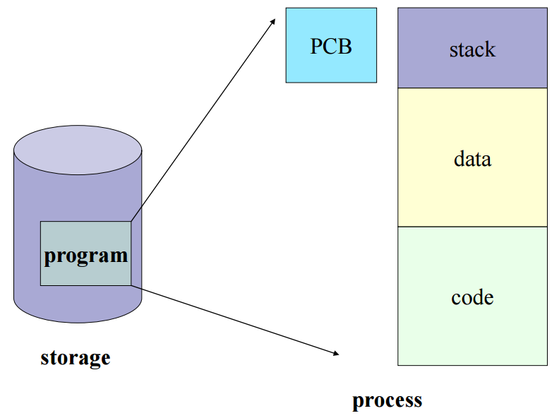

# PCB & Context Switching
### Process Management
> 프로세스가 여러개일 때, CPU가 프로세스들을 CPU 스케줄링을 통해 관리하는 것을 말함     
CPU는 `Process Metadata`를 통해 각 프로세스를 구분

**Process Metadata에 담긴 정보**
1. Process ID
2. Process State
3. Process Priority
4. CPU Registers
5. Owner
6. CPU Usage
7. Memory Usage     

=> 해당 메타데이터는 프로세스가 생성되면 `PCB(Process Control Block)`에 저장됨

### PCB(Process Control Block)
프로세스 메타데이터들을 저장해 놓는 곳, 한 PCB 안에는 한 프로세스의 정보가 담김
    
<pre><code>프로세스 실행 → 프로세스 생성 → 프로세스 주소 공간에 (코드, 데이터, 스택) 생성        
→ 이 프로세스의 메타데이터들이 PCB에 저장 </code></pre>

**PCB 필요 이유**   
CPU에서는 프로세스의 상태에 따라 교체작업이 이루어짐.       
(Interrupt가 발생해서 할당받은 프로세스가 waiting 상태가 되고 다른 프로세스를       
running으로 바꿔줄 때)      
❗️이때, 다시 수행할 waiting 프로세스에 대한 정보를 PCB에 저장해둠

**PCB 관리 방식**   
`Linked List 방식`으로 관리됨       
PCB List Head에 PCB들이 생성될 때마다 붙게 됨. 연결리스트 구조이기에 삽입, 삭제 용이        
=> 프로세스 생성되면 해당 PCB가 생성되고 프로세스 완료 시 제거      

### Context Switching
수행 중인 프로세스를 변경할 때, CPU가 이전의 프로세스 상태를 PCB에 보관하고     
다른 프로세스의 정보를 PCB에 읽어 레지스터에 적재하는 과정      

보통 인터럽트가 발생하거나, 실행 중인 CPU 사용 허가시간을 모두 소모하거나,       
입출력을 위해 대기해야 하는 경우에 발생     

`즉, 프로세스가 Ready → Running, Running → Ready, Running → Waiting처럼 상태 변경 시 발생`

### Context Switching의 OverHead란?
CPU가 계속 일할 수 있도록 Context Switching해서 계속 프로세스를 할당해 CPU의 효율성을 극대화하는 것 
<pre><code>프로세스를 수행하다가 입출력 이벤트가 발생해서 대기 상태로 전환시킴      
이때, CPU를 그냥 놀게 놔두는 것보다 다른 프로세스를 수행시키는 것이 효율적</code></pre>
