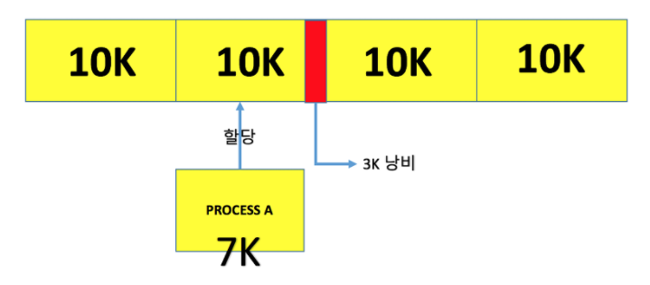
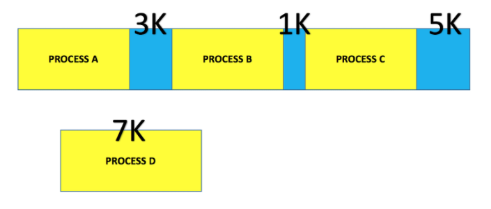

### 페이징과 세그멘테이션
**페이징과 세그멘테이션 기법을 쓰는 이유**
> 다중 프로그래밍 시스템에 여러 프로세스를 수용하기 위해       
> 주 기억장치를 동적 분할하는 메모리 관리 작업이 필요하기 때문

💡 **다중 프로그래밍 시스템**
- 컴퓨터의 `주기억장치에 여러개의 프로그램을 상주`시켜 
하나의 CPU로 여러 프로그램을 실행하는 것처럼 처리하는 시스템
- 한 프로그램이 CPU를 사용하다 입출력 처리하느라 CPU 사용 안하면 그동안 다른 프로그램이 CPU에 할당되는 식

💡 **다중 처리 시스템**
- `복수의 CPU를 사용`해 다중 작업을 처리하는 시스템
- 복수의 CPU가 메모리를 공유해 동시에 작업 처리

### 메모리 단편화
**메모리 단편화**: RAM에서 메모리 공간이 작은 조각으로 나뉘어져 사용가능한 메모리가 `충분히 존재`하는데
`할당이 불가능`한 상태
1. 내부 단편화: 프로세스가 필요한 것보다 많은 메모리가 할당돼서 프로세스에서 사용하는 메모리 공간이 낭비되는 현상

2. 외부 단편화: 프로세스 실행에 필요한 메모리 공간이 충분한데 공간이 띄엄띄엄 있어서 프로세스 할당 못 하는 현상

### 메모리 관리 기법
1. 연속 메모리 관리: 프로그램 전체가 `하나의 커다란 공간에 연속적으로 할당`되어야 함
    - 고정 분할 기법: 주기억장치가 고정된 파티션으로 분할 (**내부 단편화 발생**)
    - 동적 분할 기법: 파티션들이 동적 생성되며 자신과 같은 크기의 파티션에 적재 (**외부 단편화 발생**)
2. 불연속 메모리 관리: 프로그램의 일부가 서로 다른 주소 공간에 할당될 수 있는 기법
    - 페이지: 고정 사이즈의 작은 프로세스 조각
    - 프레임: 페이지 크기와 같은 주기억장치 메모리 조각
    - 단편화: 기억 장치의 빈 공간 or 자료가 여러 조각으로 나뉘는 현상
    - 세그먼트: 서로 다른 크기를 가진 논리적 블록이 연속적 공간에 배치되는 것
   
    **고정 크기**: 페이징      
    **가변 크기**: 세그멘테이션